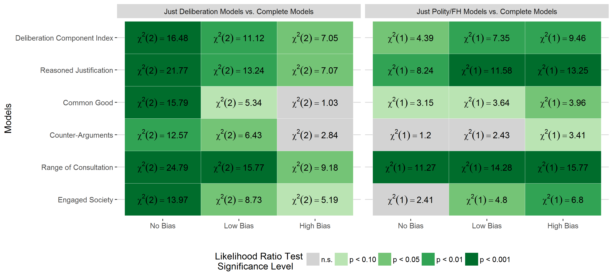
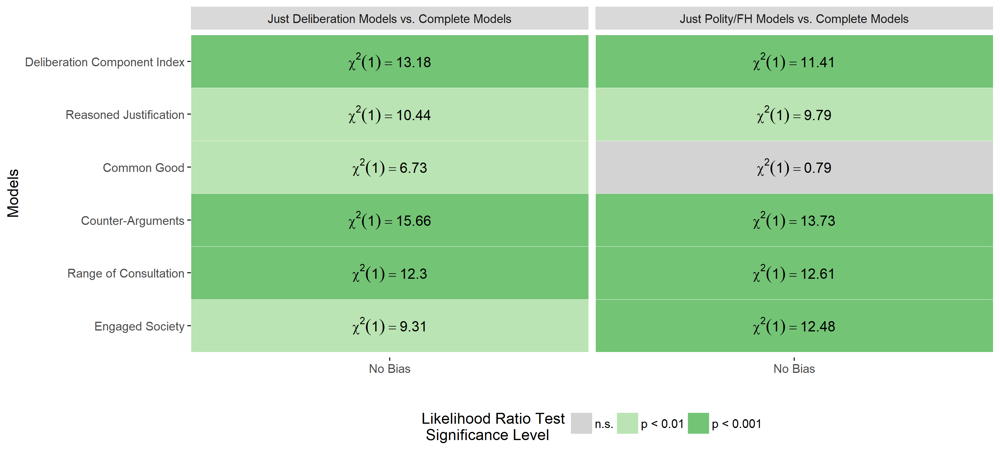
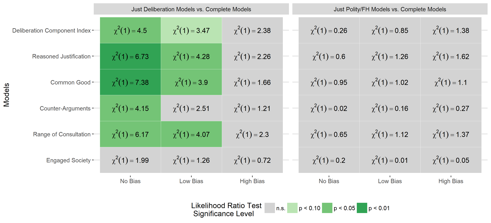

```{r setup, include=FALSE}
library(flexdashboard)
library(tidyverse)
```

```{r data, include=FALSE}


# pacman::p_install_gh("juba/rmdformats")

# dir("data/mods")

# mods1_c <- get(load("data/mods/mods1_c.Rdata"))
# mods2_c <- get(load("data/mods/mods2_c.Rdata"))
# mods3_c <- get(load("data/mods/mods3_c.Rdata"))
# 
# 
# mods1_pol <- get(load("data/mods/mods1_pol.Rdata"))
# mods2_pol <- get(load("data/mods/mods2_pol.Rdata"))
# mods3_pol <- get(load("data/mods/mods3_pol.Rdata"))
# 
# mods1_c_dem <- get(load("data/mods/mods1_c_dem.Rdata"))
# mods1_pol_dem <- get(load("data/mods/mods1_pol_dem.Rdata"))
# 
# mods1_c_nondem <- get(load("data/mods/mods1_c_nondem.Rdata"))
# mods2_c_nondem <- get(load("data/mods/mods2_c_nondem.Rdata"))
# mods3_c_nondem <- get(load("data/mods/mods3_c_nondem.Rdata"))
# 
# 
# mods1_pol_nondem <- get(load("data/mods/mods1_pol_nondem.Rdata"))
# mods2_pol_nondem <- get(load("data/mods/mods2_pol_nondem.Rdata"))
# mods3_pol_nondem <- get(load("data/mods/mods3_pol_nondem.Rdata"))
# 
# polity_complete <- get(load("data/mods/polity_complete.Rdata"))
# polity_dem <- get(load("data/mods/polity_dem.Rdata"))
# polity_nondem <- get(load("data/mods/polity_nondem.Rdata"))
# 
# # mods1_pol_nondem
# 
# memory.limit(40000)
```

Summary Table {data-navmenu="Operationalization and Descriptives"}
=========================================


Column {.tabset .tabset-fade}
-------------------------------------


<center>
Table A1: Summary Table
<center>

```{r}
library(kableExtra)

load("data/html_summary.Rdata")

knitr::kable(html_summary, format = "html", table.attr = "style='width:30%;'") %>%
  kable_styling(position = "center")


```


Heatmap of all used Variables {data-navmenu="Operationalization and Descriptives"}
=========================================


Column {.tabset .tabset-fade}
-------------------------------------

<center>
Figure A1: Heatmap of all used Variables
<center>

```{r fig.height=10, fig.width=10, fig.align='center'}
knitr::include_graphics("images/heatmap_fin.png")
```


Operationalization Regime Support {data-navmenu="Operationalization and Descriptives"}
=========================================


Column {.tabset .tabset-fade}
-------------------------------------

<center>
Table A3: Operationalization of Regime Support
<center>

```{r}
htmltools::includeHTML("tables/regime_support.htm")
```
<br>
<br>
<center>
Table A4: Factor Analysis
<center>

```{r}
htmltools::includeHTML("tables/factor_analysis.html")
```
Varimax Rotation

Control Variables {data-navmenu="Operationalization and Descriptives"}
=========================================


Column {.tabset .tabset-fade}
-------------------------------------

<center>
Table A5: Control Variables
<center>

```{r}
htmltools::includeHTML("tables/controls.htm")


```

<center>
*Reference Category:  Anocracies

** Reference Category:  World Value Survey
</center>

Country List {data-navmenu="Operationalization and Descriptives"}
=========================================


Column {.tabset .tabset-fade}
-------------------------------------

<center>
Table A5: Country Table
<center>

```{r}
load("data/country_table.Rdata")

knitr::kable(country_table, format = "html", table.attr = "style='width:30%;'") %>%
  kable_styling(position = "center")


```


Complete Sample: Statistical models A1.1 to F1.3 {data-navmenu="Regression Tables"}
=========================================

Column {.tabset .tabset-fade}
-------------------------------------

<center>
Table A6: Complete Sample: Statistical models A1.1 to F1.3
<center>


```{r, results='asis'}
# library(texreg)
# 
# htmlreg(list(mods1_c[[1]], mods2_c[[1]], mods3_c[[1]],
#                mods1_c[[3]], mods2_c[[3]], mods3_c[[3]],
#                mods1_c[[4]], mods2_c[[4]], mods3_c[[4]],
#                mods1_c[[5]], mods2_c[[5]], mods3_c[[5]],
#                mods1_c[[2]], mods2_c[[2]], mods3_c[[2]],
#                mods1_c[[6]], mods2_c[[6]], mods3_c[[6]]) %>% unlist,
#           label = "mods_c",
#           caption = "Bolded coefficients, custom notes, three digits.",
#           custom.coef.names =  c("Intercept",
#                          "Financial Security",
#                          "Education",
#                          "Employment (0/1)",
#                          "Age",
#                          "Sex (Male/Female)",
#                          "DCI",
#                          "logged Population",
#                          "logged GDP per capita",
#                          "Life Expectancy",
#                          "Urban Pop. Ratio",
#                           "Afrobarometer (0/1)",
#                          "Latinobarometro (0/1)",
#                          "Americasbarometer (0/1)",
#                          "Asianbarometer (0/1)",
#                          "ESS (0/1)",
#                          "Reasoned Justification",
#                          "Common Good",
#                          "Counter-Arguments",
#                          "Range of Consultation",
#                          "Engaged Society"),
#           digits = 2, leading.zero = FALSE, stars = c(0.001, 0.01, 0.05, 0.1),
#           symbol = "^", reorder.coef = c(1:6, 8:12, 13:16, 7, 17:21),
#           float.pos = "h", bold = 0.10,
#           custom.note = "***p < 0.001, **p < 0.01, *p < 0.05, ^p < 0.1. Models show unstandardized b-coefficients and all predictors are normalized from 0 to 1. Reference category for dataset dummies is World Value Survey. Models estimated with Restricted Maximum Likelihood. Data weighted to same sample size (=1000). Own calculations.",
#           groups = list("<strong>Individual-Level Control Variables</strong>" = 2:6,
#                         "<strong>Country-Level Control Variables</strong>" = 7:10,
#                         "<strong>Dataset Control Dummies</strong>" = 11:15,
#                         "<strong>DCI & Subcomponents</strong>" = 16:21),
#         file = "tables/mods_c.html",
#         inline.css = TRUE,
#         body.tag = T,
#         head.tag = T,
#         html.tag = T)

htmltools::includeHTML("tables/mods_c.html")
```


Complete Sample (including Polity/FH dummies): Statistical models A1.4 to F1.6 {data-navmenu="Regression Tables"}
=========================================

Column {.tabset .tabset-fade}
-------------------------------------

<center>
Table A7: Complete Sample (including Polity/FH dummies): Statistical models A1.4 to F1.6
<center>


```{r, results='asis'}
library(texreg)

# htmlreg(list(mods1_pol[[1]], mods2_pol[[1]], mods3_pol[[1]],
#                mods1_pol[[3]], mods2_pol[[3]], mods3_pol[[3]],
#                mods1_pol[[4]], mods2_pol[[4]], mods3_pol[[4]],
#                mods1_pol[[5]], mods2_pol[[5]], mods3_pol[[5]],
#                mods1_pol[[2]], mods2_pol[[2]], mods3_pol[[2]],
#                mods1_pol[[6]], mods2_pol[[6]], mods3_pol[[6]]) %>% unlist,
#           label = "mods_c",
#           #caption = "Bolded coefficients, custom notes, three digits.",
#           float.pos = "h", bold = 0.10,
#          # custom.note = "Coefficients with $p < 0.05$ in \\textbf{bold}.",
#                 file = "tables/mods_pol.html",
#           digits = 2, leading.zero = FALSE, stars = c(0.001, 0.01, 0.05, 0.1),
#           symbol = "^", reorder.coef = c(1:6, 8:13, 14:18, 7, 19:23),
#           groups = list("<strong>Individual-Level Control Variables</strong>" = 2:6,
#                         "<strong>Country-Level Control Variables</strong>" = 7:12,
#                         "<strong>Dataset Control Dummies</strong>" = 13:17,
#                         "<strong>DCI & Subcomponents</strong>" = 18:23),
#           custom.note = "***p < 0.001, **p < 0.01, *p < 0.05, ^p < 0.1. Models show unstandardized b-coefficients and all predictors are normalized from 0 to 1. Reference category for dataset dummies is World Value Survey. Reference category for Polity/FH dummies is Anocracies. Models estimated with Restricted Maximum Likelihood. Data weighted to same sample size (=1000). Own calculations.",
#           custom.coef.names =  c("Intercept",
#                          "Financial Security",
#                          "Education",
#                          "Employment (0/1)",
#                          "Age",
#                          "Sex (Male/Female)",
#                          "DCI",
#                          "Democracy (0/1)",
#                          "Autocracy (0/1)",
#                          "logged Population",
#                          "logged GDP per capita",
#                          "Life Expectancy",
#                          "Urban Pop. Ratio",
#                          "Afrobarometer (0/1)",
#                          "Latinobarometro (0/1)",
#                          "Americasbarometer (0/1)",
#                          "Asianbarometer (0/1)",
#                          "ESS (0/1)",
#                          "Reasoned Justification",
#                          "Common Good",
#                          "Counter-Arguments",
#                          "Range of Consultation",
#                          "Engaged Society"),
#         #custom.model.names = rep("what", 18),
# 
#         inline.css = TRUE,
#         body.tag = T,
#         head.tag = T,
#         html.tag = T)

htmltools::includeHTML("tables/mods_pol.html")
```


Democracy Sample: Statistical models A2.1 to F2.2 {data-navmenu="Regression Tables"}
=========================================


Column {.tabset .tabset-fade}
-------------------------------------

<center>
Table A8: Democracy Sample: Statistical models A2.1 to F2.2
<center>


```{r}
# htmlreg(list(mods1_c_dem[[1]], mods1_pol_dem[[1]],
#                mods1_c_dem[[3]], mods1_pol_dem[[3]],
#                mods1_c_dem[[4]], mods1_pol_dem[[4]],
#                mods1_c_dem[[5]], mods1_pol_dem[[5]],
#                mods1_c_dem[[2]], mods1_pol_dem[[2]],
#                mods1_c_dem[[6]], mods1_pol_dem[[6]]) %>% unlist,
#           label = "mods_c",
#           caption = "Bolded coefficients, custom notes, three digits.",
#           custom.coef.names =  c("Intercept",
#                          "Financial Security",
#                          "Education",
#                          "Employment (0/1)",
#                          "Age",
#                          "Sex (Male/Female)",
#                          "DCI",
#                          "logged Population",
#                          "logged GDP per capita",
#                          "Life Expectancy",
#                          "Urban Pop. Ratio",
#                          "Afrobarometer (0/1)",
#                          "Latinobarometro (0/1)",
#                          "Americasbarometer (0/1)",
#                          "Asianbarometer (0/1)",
#                          "ESS (0/1)",
#                          "Polity/FH",
#                          "Reasoned Justification",
#                          "Common Good",
#                          "Counter-Arguments",
#                          "Range of Consultation",
#                          "Engaged Society"),
#                 file = "tables/mods_dem.html",
#           digits = 2, leading.zero = FALSE, stars = c(0.001, 0.01, 0.05, 0.1),
#           symbol = "^", reorder.coef = c(1:6, 8:11, 17,  12:16, 7, 18:22),
#           groups = list("<strong>Individual-Level Control Variables</strong>" = 2:6,
#                 "<strong>Country-Level Control Variables</strong>" = 7:11,
#                 "<strong>Dataset Control Dummies</strong>" = 12:16,
#                 "<strong>DCI & Subcomponents</strong>" = 17:22),
#           float.pos = "h", bold = 0.10,
#           custom.note = "***p < 0.001, **p < 0.01, *p < 0.05, ^p < 0.1. Models show unstandardized b-coefficients and all predictors are normalized from 0 to 1. Reference category for dataset dummies is World Value Survey. Models estimated with Restricted Maximum Likelihood. Data weighted to same sample size (=1000). Own calculations.",
#         inline.css = TRUE,
#         body.tag = T,
#         head.tag = T,
#         html.tag = T)

htmltools::includeHTML("tables/mods_dem.html")
```


Non-Democracies Sample: Statistical models A3.1 to F3.3 {data-navmenu="Regression Tables"}
=========================================

Column {.tabset .tabset-fade}
-------------------------------------

<center>
Table A9: Non-Democracies Sample: Statistical models A3.1 to F3.3
<center>

```{r}
library(texreg)

# htmlreg(list(mods1_c_nondem[[1]], mods2_c_nondem[[1]], mods3_c_nondem[[1]],
#                mods1_c_nondem[[3]], mods2_c_nondem[[3]], mods3_c_nondem[[3]],
#                mods1_c_nondem[[4]], mods2_c_nondem[[4]], mods3_c_nondem[[4]],
#                mods1_c_nondem[[5]], mods2_c_nondem[[5]], mods3_c_nondem[[5]],
#                mods1_c_nondem[[2]], mods2_c_nondem[[2]], mods3_c_nondem[[2]],
#                mods1_c_nondem[[6]], mods2_c_nondem[[6]], mods3_c_nondem[[6]]) %>% unlist,
#           label = "mods1_c_nondem",
#                 file = "tables/mods_c_nondem.html",
#           caption = "Bolded coefficients, custom notes, three digits.",
#           float.pos = "h", bold = 0.10,
#           custom.note = "***p < 0.001, **p < 0.01, *p < 0.05, ^p < 0.1. Models show unstandardized b-coefficients and all predictors are normalized from 0 to 1. Reference category for dataset dummies is World Value Survey. Models estimated with Restricted Maximum Likelihood. Data weighted to same sample size (=1000). Own calculations.",
#           digits = 2, leading.zero = FALSE, stars = c(0.001, 0.01, 0.05, 0.1),
#           symbol = "^", reorder.coef = c(1:6, 8:12, 13:16, 7, 17:21),
#           groups = list("<strong>Individual-Level Control Variables</strong>" = 2:6,
#                         "<strong>Country-Level Control Variables</strong>" = 7:10,
#                         "<strong>Dataset Control Dummies</strong>" = 11:15,
#                         "<strong>DCI & Subcomponents</strong>" = 16:21),
#           custom.coef.names =  c("Intercept",
#                          "Financial Security",
#                          "Education",
#                          "Employment (0/1)",
#                          "Age",
#                          "Sex (Male/Female)",
#                          "DCI",
#                          "logged Population",
#                          "logged GDP per capita",
#                          "Life Expectancy",
#                          "Urban Pop. Ratio",
#                           "Afrobarometer (0/1)",
#                          "Latinobarometro (0/1)",
#                          "Americasbarometer (0/1)",
#                          "Asianbarometer (0/1)",
#                          "ESS (0/1)",
#                          "Reasoned Justification",
#                          "Common Good",
#                          "Counter-Arguments",
#                          "Range of Consultation",
#                          "Engaged Society"),
# 
#         inline.css = TRUE,
#         body.tag = T,
#         head.tag = T,
#         html.tag = T)

htmltools::includeHTML("tables/mods_c_nondem.html")

# paste(readLines("tables/mods_c_nondem.html"), collapse="") %>% 
#   str_replace("educ", "Education") %>% 
#   htmltools::html_print()
```


Non-Democracies Sample (including Polity/FH): Statistical models A3.4 to F3.6 {data-navmenu="Regression Tables"}
=========================================


Column {.tabset .tabset-fade}
-------------------------------------

<center>
Table A10: Non-Democracies Sample (including Polity/FH): Statistical models A3.4 to F3.6
<center>


```{r}
# library(texreg)
# htmlreg(list(mods1_pol_nondem[[1]], mods2_pol_nondem[[1]], mods3_pol_nondem[[1]],
#                mods1_pol_nondem[[3]], mods2_pol_nondem[[3]], mods3_pol_nondem[[3]],
#                mods1_pol_nondem[[4]], mods2_pol_nondem[[4]], mods3_pol_nondem[[4]],
#                mods1_pol_nondem[[5]], mods2_pol_nondem[[5]], mods3_pol_nondem[[5]],
#                mods1_pol_nondem[[2]], mods2_pol_nondem[[2]], mods3_pol_nondem[[2]],
#                mods1_pol_nondem[[6]], mods2_pol_nondem[[6]], mods3_pol_nondem[[6]]) %>% unlist,
#           label = "mods_c",
#           caption = "Bolded coefficients, custom notes, three digits.",
#           float.pos = "h", bold = 0.10,
#           custom.note = "***p < 0.001, **p < 0.01, *p < 0.05, ^p < 0.1. Models show unstandardized b-coefficients and all predictors are normalized from 0 to 1. Reference category for dataset dummies is World Value Survey. Models estimated with Restricted Maximum Likelihood. Data weighted to same sample size (=1000). Own calculations.",
#                        file = "tables/mods_pol_nondem.html",
#           digits = 2, leading.zero = FALSE, stars = c(0.001, 0.01, 0.05, 0.1),
#           symbol = "^", reorder.coef = c(1:6, 8:12, 13:17, 7, 18:22),
#           groups = list("<strong>Individual-Level Control Variables</strong>" = 2:6,
#                         "<strong>Country-Level Control Variables</strong>" = 7:11,
#                         "<strong>Dataset Control Dummies</strong>" = 12:16,
#                         "<strong>DCI & Subcomponents</strong>" = 17:22),
#           custom.coef.names =  c("Intercept",
#                          "Financial Security",
#                          "Education",
#                          "Employment (0/1)",
#                          "Age",
#                          "Sex (Male/Female)",
#                          "DCI",
#                          "Polity/FH",
#                          "logged Population",
#                          "logged GDP per capita",
#                          "Life Expectancy",
#                          "Urban Pop. Ratio",
#                          "Afrobarometer (0/1)",
#                          "Latinobarometro (0/1)",
#                          "Americasbarometer (0/1)",
#                          "Asianbarometer (0/1)",
#                          "ESS (0/1)",
#                          "Reasoned Justification",
#                          "Common Good",
#                          "Counter-Arguments",
#                          "Range of Consultation",
#                          "Engaged Society"),
#         #custom.model.names = rep("what", 18),
# 
#         inline.css = TRUE,
#         body.tag = T,
#         head.tag = T,
#         html.tag = T)

htmltools::includeHTML("tables/mods_pol_nondem.html")
```


Polity/FH: Statistical models P1.1 to P.3.3 {data-navmenu="Regression Tables"}
=========================================


Column {.tabset .tabset-fade}
-------------------------------------

<center>
Table A11: Polity/FH: Statistical models P1.1 to P.3.3
<center>


```{r}
library(texreg)
# htmlreg(list(polity_complete, polity_dem, polity_nondem) %>% unlist,
#           label = "mods_c",
#           #caption = "Bolded coefficients, custom notes, three digits.",
#           float.pos = "h", bold = 0.10,
#           custom.note = "***p < 0.001, **p < 0.01, *p < 0.05, ^p < 0.1. Models show unstandardized b-coefficients and all predictors are normalized from 0 to 1. Reference category for dataset dummies is World Value Survey. Models estimated with Restricted Maximum Likelihood. Data weighted to same sample size (=1000). Own calculations.",
#                 file = "tables/polity_complete.html",
#           digits = 2, leading.zero = FALSE, stars = c(0.001, 0.01, 0.05, 0.1),
#           symbol = "^", reorder.coef = c(1:6, 9:12, 13:17, 7:8, 18),
#           groups = list("<strong>Individual-Level Control Variables</strong>" = 2:6,
#                         "<strong>Country-Level Control Variables</strong>" = 7:10,
#                         "<strong>Dataset Control Dummies</strong>" = 11:15,
#                         "<strong>Polity/FH Variables</strong>" = 16:18),
#           custom.coef.names =  c("Intercept",
#                                  "Financial Security",
#                                  "Education",
#                                  "Employment (0/1)",
#                                  "Age",
#                                  "Sex (Male/Female)",
#                                  "Democracy (0/1)",
#                                  "Autocracy (0/1)",
#                                  "logged Population", 
#                                  "logged GDP per capita",
#                                  "Life Expectancy",
#                                  "Urban Pop. Ratio",
#                                   "Afrobarometer (0/1)",
#                                  "Latinobarometro (0/1)",
#                                  "Americasbarometer (0/1)",
#                                  "Asianbarometer (0/1)",
#                                  "ESS (0/1)",
#                                  "Polity/FH"),
#         #custom.model.names = rep("what", 18),
# 
#         inline.css = TRUE,
#         body.tag = T,
#         head.tag = T,
#         html.tag = T)

htmltools::includeHTML("tables/polity_complete.html")


```


Complete Sample Models {data-navmenu="Model Comparisons"}
=========================================


Column {.tabset .tabset-fade}
-------------------------------------

<center>
Figure A2: Complete Sample Models - Model Comparisons
<center>


```{r fig.height=15, fig.width=12, fig.align='center'}

```


Democracies Sample Models {data-navmenu="Model Comparisons"}
=========================================


Column {.tabset .tabset-fade}
-------------------------------------

<center>
Figure A3: Democracies Sample Models - Model Comparisons
<center>


```{r fig.height=15, fig.width=12, fig.align='center'}

```


Non-Democracies Sample Models {data-navmenu="Model Comparisons"}
=========================================


Column {.tabset .tabset-fade}
-------------------------------------

<center>
Figure A4: Non-Democracies Sample Models - Model Comparisons
<center>


```{r fig.height=15, fig.width=12, fig.align='center'}

```

