    

```{r xaringan-themer, include = FALSE}
# library(xaringanthemer)
# mono_accent(base_color = "#252525", link_color	= "rgb(198, 219, 239)")
```

<style>
.onehundredtwenty {
  font-size: 120%;
   }

<style>
.ninety {
  font-size: 90%;
   }

.eightyfive {
  font-size: 85%;
   }
   
.eighty {
  font-size: 80%;
   }
   
.seventyfive {
  font-size: 75%;
   }
   
.seventy {
  font-size: 70%;
   }
</style>


```{r setup, echo = F, include=F}
# include=FALSE
options(htmltools.dir.version = FALSE)

pacman::p_load(tidyverse, xaringan)

knitr::opts_chunk$set(echo = F, warning = F, error = F, message = F)

```


<br>
<br>
<br>
<br>
<br>
<br>
<br>
<br>

.onehundredtwenty[

Research Question:

> What role does deliberation play for regime legitimacy across the world? 

]


---

## Outline

.onehundredtwenty[

1. Theoretical Framework
2. Data & Methodology
3. Challenges
4. Analysis & Results
5. Conclusions & Future Research

]


---

class: inverse, center, middle

## Theoretical Link between <br> Deliberation and Regime Legitimacy 


---

## Theory

+ Central claim of deliberative theory: 
    + to arrive at (more) legitimate decisions 
    + see for example Habermas (1994: 7–8) & Warren & Gastil (2015: 562)


--
+ Conceptualization of legitimacy as regime support 


--
+ General assumption: deliberative qualities of a political system increase support from its citizens


--
+ Consequences of *Authoritarian Deliberation* (He & Warren, 2011)
    + Authoritarian regimes might use deliberation to *increase* support  
    + Might *decrease* support due to increasing democratic capabilites 


---

class: inverse, center, middle


## Data & Methodology


---

#### Data & Methodology

**Individual-Level Data**
+ Merging of the following datasets: 
  + Afrobarometer Survey, Round 5 and Round 6 (data from 2011-2015)  
  + Asian Barometer Survey, Wave 3 and Wave 4 (2010-2015) 
  + AmericasBarometer (2010-2014) 
  + European Social Survey, Round 6 (2012) 
  + Latinobarómetro (2015) 
  + World Values Survey (2010-2014)

+ In total 316,938 individual cases in 119 Countries
  + weighted to same sample size (=1000)


--

**Country-Level Data**
+ "Varieties of Democracy"-Dataset: Deliberative Component Index
+ Control variables come from V-Dem and the QoG-Dataset
+ Lagging of Independent Variables (Averaging from 2000 - 2010)

---

#### Data & Methodology

.ninetyfive[

+ Control Variables
    + Micro Level
        + Age
        + Sex (Male/Female)
        + Financial Security
        + Education
        + Employment (0/1)
    + Macro Level
        + Polity/FH
        + Democracy (0/1)<sup>1</sup>
        + Autocracy (0/1)<sup>1</sup>
        + logged GDP per capita
        + logged Population
        + Life Expectancy
        + Urban Pop. Ratio
    + Survey dummies
        + WVS, Afrobarometer, Latinobarometro, Americasbarometer, Asianbarometer, ESS
        
]

<font size='1'><sup>1</sup>We apply the Polity2-classification of democracies, anocracies and autocracies. Polity/FH was rescaled to range from -10 to +10 and the cut-off values are set at 6 and -6 (-10 – -6 = Autocracy; -5 – 5 =Anocracy; 6 – 10 = Democracy).</font>


---


## Operationalization of Regime Support

Three types of traditional political branches
+ executive (political leadership)
+ judicial and legal system (courts and police)
+ legislation (parliament) 


```{r}
htmltools::includeHTML("tables/factor_analysis.html")
```


---

## Deliberative Component Index (DCI)

<center>
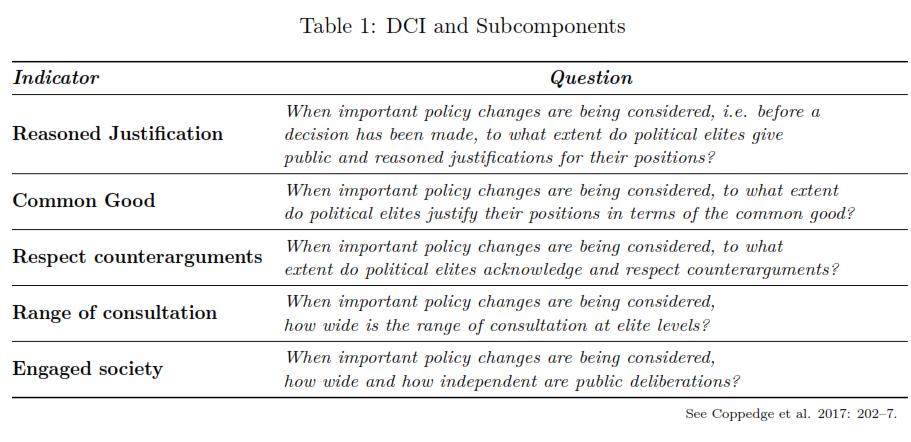
</center>


---

class: inverse, center, middle


## Challenges

---

## Challenges

*Two major challenges emerged:*

+ Colinearity between Deliberation indicators and Democracy Measures

--

+ Possibly biased self-reported regime support 

--

<br>

#### Multicolinearity issue


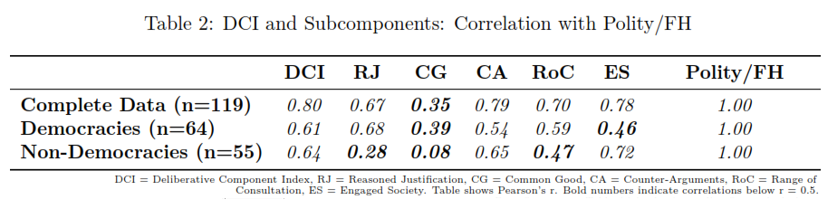

---

#### Correlation between DCI and Polity/FH


<center>
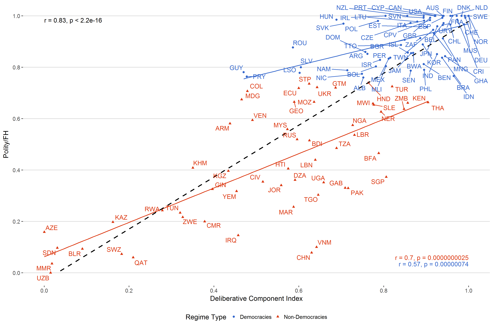
</center>


---


#### Possibly biased self-reported Regime Support 


---

#### Correlation between Regime Support and Discussion Suppression 


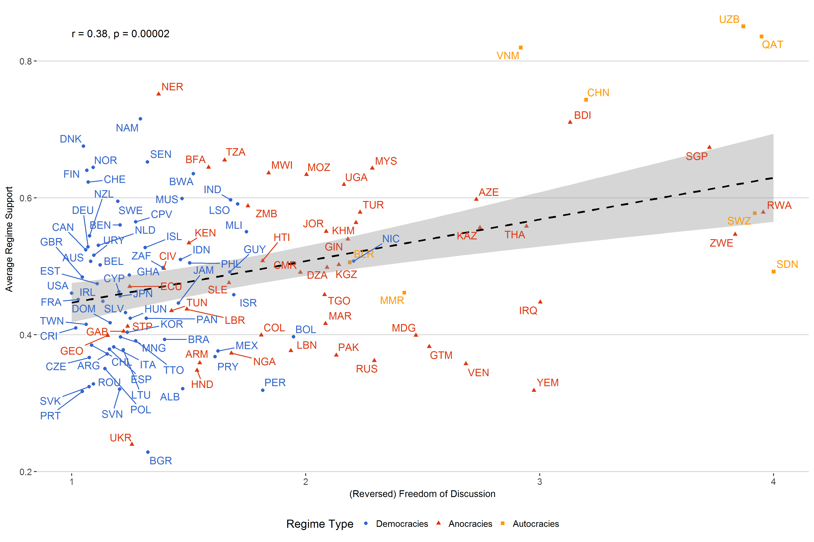


---

#### Weighting of Regime Support

<br>


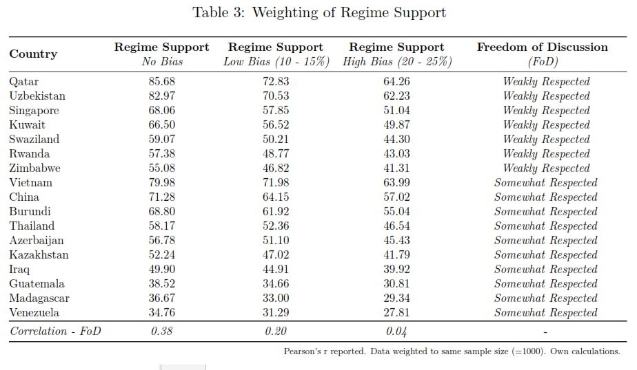

---

class: inverse, center, middle


## Analysis & Results

---

## Analysis

Given the hierarchical nature of the data we estimate *multilevel models*
+ Dependent Variables
    + Regime Support *(No Bias)*   -> `ICC: 44.97%`
    + Regime Support *(Low Bias)*  -> `ICC: 41.70%`
    + Regime Support *(High Bias)* -> `ICC: 40.97%`

--
    
+ Main independent variables
    + Deliberative Component Index (DCI)
    + plus all five components of the DCI

--

+ In total 91 seperate models
    + split into three subsamples (Complete, Democracies, Non-Democracies)
 
--

*Note: complete sample uses dummy variables of Polity/FH because of non-linearity and multicolinearity issues*


---

## Results


<a href="https://raw.githubusercontent.com/favstats/delib_slides/master/images/slides_coefplot.png" target = "blank"> 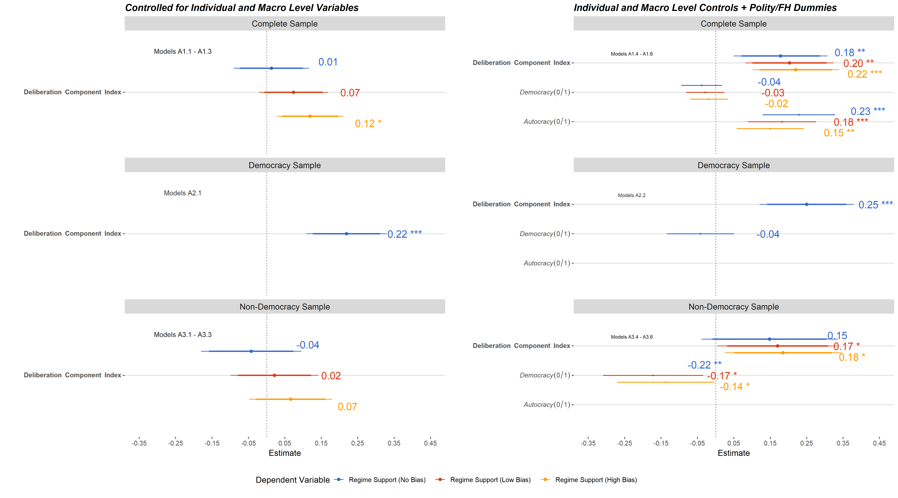 </a>

*Click on picture for larger Version*

---

### Model Comparisons -Just Polity/FH Models vs. Complete Models

<br>

<a href="https://github.com/favstats/delib_slides/raw/master/images/model_comparison_polities.png" target = "blank"> 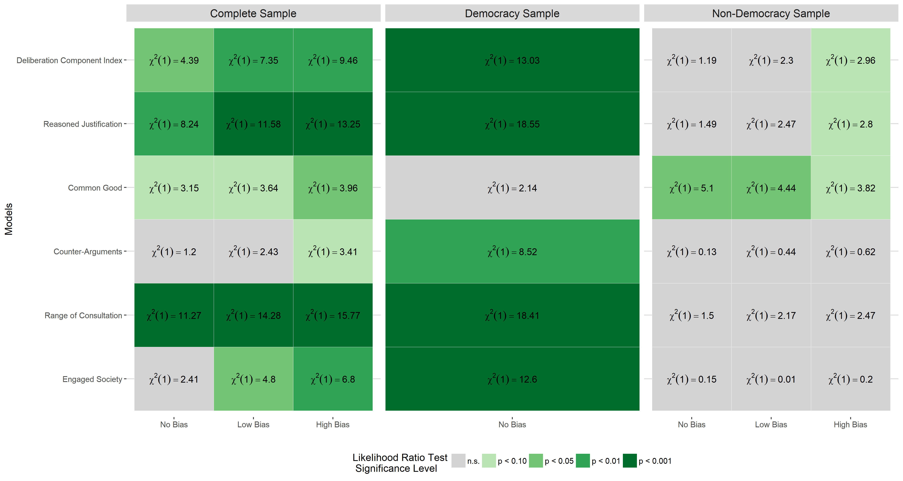 </a>

*Click on picture for larger Version*

---

class: inverse, center, middle

## Conclusions & Future Research

---

## Conclusions & Future Research

* No simple answer to research question
 + deliberation seems to have a *positive effect* on regime support *in democracies*
 + less robust and *ambiguous results for non-democracies and complete sample*
    
--

* Presumably biased regime support
 + should be taken into account 
 + possible remedies? (e.g. weighting procedures, survey design)
 + individual-level vs. country-level weighting?

--


* Validity of the DCI
    + more sensitive approaches to measure deliberation on the country level are neccessary
    + nevertheless interesting differences regarding the subsamples

---

class: inverse, center, middle


## Thanks for Listening!

Full Paper: <a href='https://www.academia.edu/36656020/Deliberation_Across_the_World_A_Cross-National_Examination_of_the_Link_Between_Deliberation_and_Regime_Legitimacy'>Deliberation Across the World</a>

Slides: <a href='deliberation-and-legitimacy.netlify.com'>https://deliberation-and-legitimacy.netlify.com </a>

Online Appendix can be found <a href='https://favstats.github.io/delib_mod_database'>here</a>

Code and Data on <a href='https://github.com/favstats/paper_delib'>GitHub</a>


---

## References

*Habermas, J. (1994). Three normative models of democracy. Constellations, 1 (1), 1–10.*

*He, B., & Warren, M. E. (2011). Authoritarian deliberation: The deliberative turn in chinese political development. Perspectives on Politics, 9 (2), 269–289.*

*Tannenberg, M. (2017). The autocratic trust bias: Politically sensitive survey items and self-censorship. Varieties of Democracy Institute: Working Paper, (49), 1–31.*

*Warren, M. E., & Gastil, J. (2015). Can deliberative minipublics address the cognitive challenges of democratic citizenship? The Journal of Politics, 77 (2), 562–574.*


---

class: inverse, center, middle

## Appendix

---


#### Operationalization of Regime Support

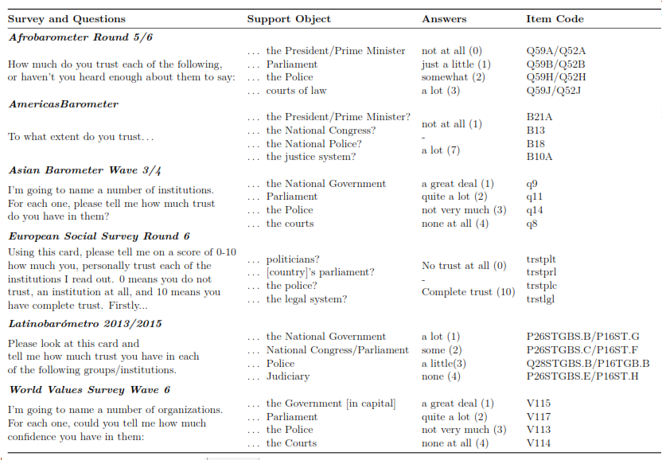

---

### Maps - Deliberation

<a href="https://github.com/favstats/delib_slides/raw/master/images/map_dci.png" target = "blank"></a>

---

### Maps - Regime Support

<a href="https://github.com/favstats/delib_slides/raw/master/images/map_regime.png" target = "blank"></a>

---

### Coefficent Plots - Complete Sample


<a href="https://github.com/favstats/delib_slides/raw/master/images/coefplot.png" target = "blank"> </a>


---

### Coefficent Plots - Democracy Sample

<a href="https://github.com/favstats/delib_slides/raw/master/images/coefplot_dem.png" target = "blank"> 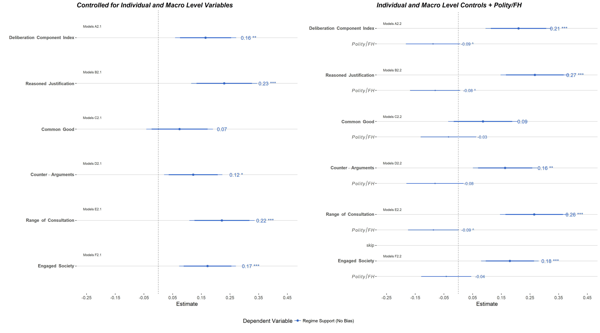</a>

---

### Coefficent Plots - Non-Democracy Sample


<a href="https://github.com/favstats/delib_slides/raw/master/images/coefplot_nondem.png" target = "blank"> </a>


---

### Model Comparisons - Just Control Models vs. Just Deliberation Models

<br>

<a href="https://github.com/favstats/delib_slides/raw/master/images/model_comparison_wo_delibs2.png" target = "blank"> 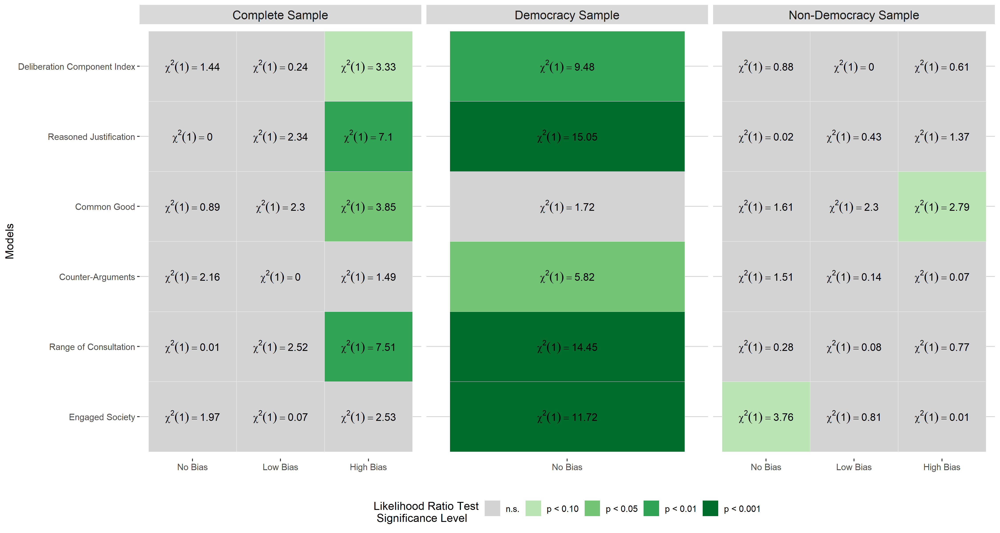</a>

---

### Model Comparisons - Complete Sample

<br>
<br>

<a href="https://github.com/favstats/delib_slides/raw/master/images/model_comparison.png" target = "blank"> </a>


---

### Model Comparisons - Democracy Sample

<br>
<br>

<a href="https://github.com/favstats/delib_slides/raw/master/images/model_comparison_dem.png" target = "blank"> </a>


---

### Model Comparisons - Non-Democracy Sample

<br>
<br>


<a href="https://github.com/favstats/delib_slides/raw/master/images/model_comparison_nondem.png" target = "blank"> 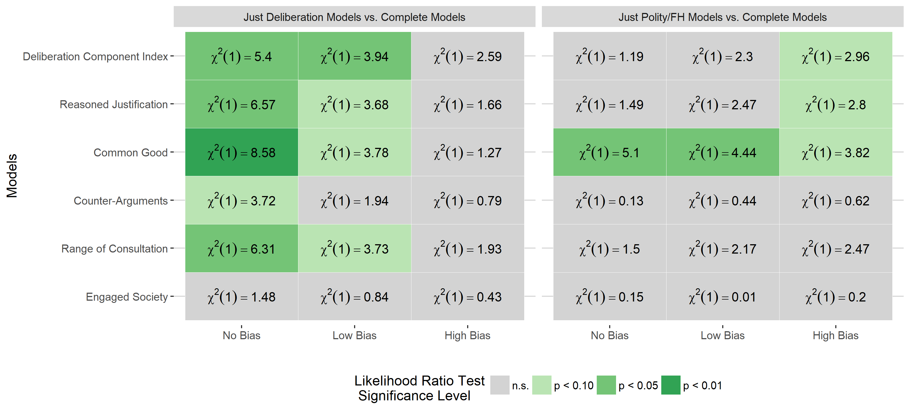</a>


